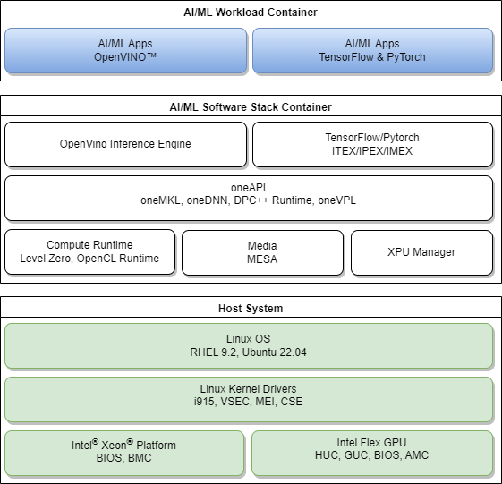

# PROJECT NOT UNDER ACTIVE MANAGEMENT #  
This project will no longer be maintained by Intel.  
Intel has ceased development and contributions including, but not limited to, maintenance, bug fixes, new releases, or updates, to this project.  
Intel no longer accepts patches to this project.  
 If you have an ongoing need to use this project, are interested in independently developing it, or would like to maintain patches for the open source software community, please create your own fork of this project.  
  
## Overview
The following diagram illustrates a high-level discrete GPU-based Linux software stack to run High Performance Computing and AI/ML workloads on Intel® Xeon® platforms with Intel® Data Center Flex Series GPUs. This document provides a sample dockerfile with build instructions to automate installations of the recommended base GPU/media user space modules and AI/ML software components on the Intel® Edge Server platform with Intel® Data Center Flex Series GPUs.



## Host System Requirement
Host Development platforms validated in this setup guide include:
- Emerald Rapids - SP (EMR-SP)
- Sapphire Rapids - EEC (SPR-EEC)
- Ice Lake - D (ICX-D)

Intel® Data Center GPU validated in this setup guide include:
- Intel® Data Center GPU Flex Series 170
- Intel® Data Center GPU Flex Series 140

## OS & Drivers Installation

### RHEL 9.2 Installation

- Please refer to [RHEL 9 Installation](https://access.redhat.com/documentation/en-us/red_hat_enterprise_linux/9/html/performing_a_standard_rhel_9_installation) for Host Operating System installation setup
- Please refer to [FLEX GPU Drivers for RHEL](https://dgpu-docs.intel.com/driver/installation.html#rhel-install-steps) for FLEX GPU Drivers Installation

### Ubuntu 22.04 Installation
- Please refer to [Ubuntu 22.04 OS Installation](https://releases.ubuntu.com/jammy) for Host Operating System installation setup
- Please refer to [FLEX GPU Drivers for Ubuntu](https://dgpu-docs.intel.com/driver/installation.html#ubuntu-install-steps) for FLEX GPU Drivers Installation

## AI Software Stack Installation
Please refer to the sample Dockerfile and build instructions below to build a docker image that contains the base GPU/media user space components, Intel® OneAPI, Intel® OpenVINO, Intel® Extension for PyTorch* (IPEX) and Intel® Extension for TensorFlow* (ITEX) AI software components to run AI/ML workloads with Docker.

### Sample Dockerfile
For example for ubuntu 22.04

```
    FROM ubuntu:22.04
    ARG PROXY ""
    ARG NO_PROXY ""
    ENV http_proxy ${PROXY}
    ENV https_proxy ${PROXY}
    ENV ftp_proxy ${PROXY}
    ENV no_proxy ${NO_PROXY}

    RUN env -u no_proxy apt-get update
    RUN env -u no_proxy apt-get install -y --no-install-recommends wget gpg ca-certificates \
        apt-utils  curl gpg-agent

    RUN env -u no_proxy -u NO_PROXY wget -qO - \
        https://repositories.intel.com/graphics/intel-graphics.key \
        | gpg --dearmor --output /usr/share/keyrings/intel-graphics.gpg

    RUN echo "deb [arch=amd64 signed-by=/usr/share/keyrings/intel-graphics.gpg] \
        https://repositories.intel.com/gpu/ubuntu \
        jammy/production/2328 unified" | tee  /etc/apt/sources.list.d/intel.gpu.jammy.list

    RUN env -u no_proxy -u NO_PROXY apt update
    RUN env -u no_proxy -u NO_PROXY apt-get install -y \
        intel-opencl-icd intel-level-zero-gpu level-zero \
        intel-media-va-driver-non-free libmfx1 libmfxgen1 libvpl2 \
        libegl-mesa0 libegl1-mesa libegl1-mesa-dev libgbm1 libgl1-mesa-dev libgl1-mesa-dri \
        libglapi-mesa libgles2-mesa-dev libglx-mesa0 libigdgmm12 libxatracker2 mesa-va-drivers \
        mesa-vdpau-drivers mesa-vulkan-drivers va-driver-all vainfo \
        intel-metrics-library \
        clinfo

    #Optional 1.0: install openapi dpcpp mkl
    ARG mkl_version=2024.0.0-49656
    ARG dpcpp_version=2024.0
    RUN env -u no_proxy -u NO_PROXY curl -fsSL \
        https://apt.repos.intel.com/intel-gpg-keys/GPG-PUB-KEY-INTEL-SW-PRODUCTS.PUB | apt-key add -
    RUN echo "deb https://apt.repos.intel.com/oneapi all main" | tee /etc/apt/sources.list.d/intel-oneapi.list
    RUN env -u no_proxy -u NO_PROXY apt update
    RUN env -u no_proxy -u NO_PROXY apt-get install -y intel-oneapi-mkl=${mkl_version} \
        intel-oneapi-compiler-dpcpp-cpp-runtime-${dpcpp_version}  \
        intel-oneapi-runtime-libs

    #Optional 1.1: install openvino runtime, Please specify --build-arg=ov_url=xxx to install specific version of openvino
    ENV INTEL_OPENVINO_DIR=/opt/intel/openvino
    ARG ov_url=https://storage.openvinotoolkit.org/repositories/openvino/packages/2023.0/linux/l_openvino_toolkit_ubuntu22_2023.0.0.10926.b4452d56304_x86_64.tgz
    WORKDIR /tmp
    RUN wget ${ov_url}
    RUN tar -xzf /tmp/*.tgz && \
        OV_BUILD="$(find . -maxdepth 1 -type d -name "*openvino*" | grep -oP '(?<=_)\d+.\d+.\d.\d+')" && \
        OV_YEAR="$(echo "$OV_BUILD" | grep -oP '^[^\d]*(\d+)')" && \
        OV_FOLDER="$(find . -maxdepth 1 -type d -name "*openvino*")" && \
        mkdir -p /opt/intel/openvino_"$OV_BUILD"/ && \
        cp -rf "$OV_FOLDER"/*  /opt/intel/openvino_"$OV_BUILD"/ && \
        rm -rf /tmp/"$OV_FOLDER" && \
        ln --symbolic /opt/intel/openvino_"$OV_BUILD"/ /opt/intel/openvino && \
        rm -rf "${INTEL_OPENVINO_DIR}/tools/workbench" && rm -rf /tmp

    RUN chmod 1777 /tmp
    RUN ${INTEL_OPENVINO_DIR}/install_dependencies/install_openvino_dependencies.sh -y \
        -c=python -c=core

    #Optional 2.0: install ipex & itex
    ARG tf_version=2.14.0
    ARG itex_version=v2.13.0.0
    ARG torch_version=2.1.0a0
    ARG ipex_version=2.1.10+xpu
    ARG torchvision=0.16.0a0
    RUN pip3 install tensorflow==${tf_version} intel-extension-for-tensorflow[gpu];
    RUN env -u no_proxy -u NO_PROXY python3 -m pip install \
        torch==${torch_version} torchvision==${torchvision} \
        intel_extension_for_pytorch==${ipex_version} \
        --extra-index-url https://pytorch-extension.intel.com/release-whl/stable/xpu/us/
    
```
- [Get Docker](https://docs.docker.com/desktop/install/linux-install/) for your host OS
- Kindly duplicate the aforementioned Dockerfile and save as `Dockerfile.ubuntu`

```
    #Example build command
    $ sudo usermod -aG docker $USER
    #in the same directory as the dockerfile
    $ docker build -t image:tag -f Dockerfile.ubuntu [--build-arg=<PROXY=xxx>] .
```

### Manual Installation
If Dockerfile method is not desired, you may install the AI software toolchains following the installation guides below.
- [Intel® oneAPI Installation Guide](https://www.intel.com/content/www/us/en/developer/articles/guide/installation-guide-for-oneapi-toolkits.html)
- [OpenVINO™ Toolkit Installation Guide](https://docs.openvino.ai/install)
- [Intel® Extension for TensorFlow Installation Guide](https://github.com/intel/intel-extension-for-tensorflow#install)
- [Intel® Extension for PyTorch Installation Guide](https://github.com/intel/intel-extension-for-pytorch#installation)

The user can run AI/ML workload on the installed software stack now.

## Support
Submit your questions, issues, bugs on the [GitHub issues](https://github.com/intel-innersource/frameworks.ai.platform.edge-dgpu/issues) page.

## Security
See Intel's [Security Center](https://www.intel.com/content/www/us/en/security-center/default.html) for information on how to report a potential security issue or vulnerability.

## License
[Apache License 2.0](LICENSE)
